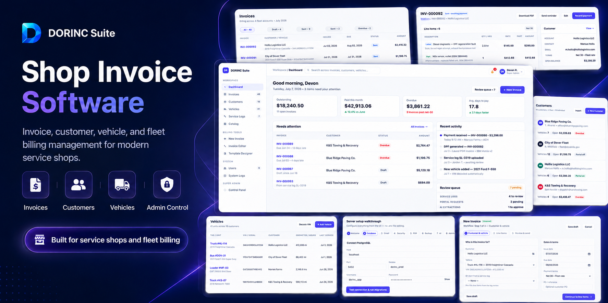

<p align="center">
  
</p>

# DORINC

Self-hosted invoice, customer, vehicle, and fleet billing software for service shops.

Deploy with **Docker Compose on Dockploy**, set two environment variables, open `/setup`, and finish configuration in the browser.

## Features

- Invoices, payments, and PDF generation
- Customers, vehicles, and fleet tracking
- Service logs, parts/labor catalog
- Customer portal
- Invoice template designer
- Admin: users, permissions, audit, backups, SMTP, optional AI

## Deploy on Dockploy

### 1. Provision PostgreSQL

Use an external database (Dockploy Postgres, managed Postgres, or your own host). PostgreSQL is **not** included in the compose stack.

### 2. Create the Compose app

In Dockploy, create a Compose application from this repo using `docker-compose.yml`.

| Service | Profile | Role |
|---|---|---|
| `nuxt-app` | default | Web app |
| `worker` | — | Mail, invoice send, backups, AI, retention |
| `pdf-worker` | — | Playwright PDF rendering |
| `migrate` | `migrate` | One-shot DB migrations on upgrade |
| `redis` | `redis` | Optional |

Persist the **`dorinc-runtime`** volume — it stores database connection settings under `.data/`.

### 3. Environment (Dockploy only)

Set **only** these two variables in the Compose Environment tab:

```env
PORT=38471
APP_URL=https://your-domain.example
```

| Variable | Purpose |
|---|---|
| `PORT` | Port the app listens on **inside** the container (default `38471`) |
| `APP_URL` | Public URL for portal links, emails, and OAuth callbacks |

Do **not** put database, SMTP, encryption keys, or AI credentials in Dockploy env — those are configured in the setup wizard.

`PORT` is not a host port. Compose uses `expose` (Docker network only). Default is **38471** so it does not clash with Dockploy or common app ports.

### 4. Domains (Dockploy)

In the **Domains** tab, add your domain and point it at:

| Field | Value |
|---|---|
| Service | `nuxt-app` |
| Port | `38471` (must match `PORT`) |

Dockploy/Traefik handles HTTPS and public routing.

### 5. Deploy and open setup

Deploy the default profile (`nuxt-app`). Then open:

```text
https://your-domain.example/setup
```

Complete the wizard:

1. Connect PostgreSQL
2. Create encryption / session keys (public URL is already set from `APP_URL`)
3. Configure SMTP (recommended)
4. Optional: PDF, backup, and AI settings
5. Create the Super Admin account

Health check: `GET /api/health`

### 6. Workers (automatic)

Every deploy starts three containers: `nuxt-app`, `worker`, and `pdf-worker`. After deploy, open **Control Panel** and confirm PDF worker and worker queue show healthy (not backlog).

### 7. Upgrades

After pulling a new release, run migrations once:

```bash
docker compose --profile migrate run --rm migrate
```

Then redeploy (all three services restart together).

## Local development

```bash
npm install
npm run dev
```

Open **http://localhost:3000/setup**. Requires Node.js 24+ and PostgreSQL.

| Command | Purpose |
|---|---|
| `npm run dev` | Dev server |
| `npm run build` | Production build |
| `npm run db:migrate` | Apply migrations |
| `npm test` | Unit + Playwright tests |

## License

Private / proprietary unless a license file is added to this repository.
